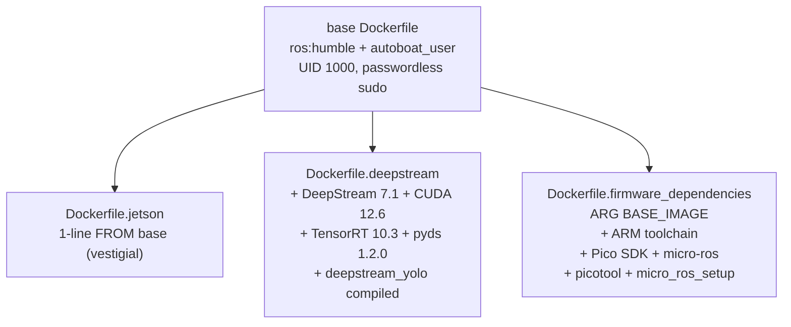

# Devcontainer & Scripts Conventions

The devcontainer is the canonical build environment (ROS Humble, `/home/ws` workspace mount). Container images are published to Docker Hub under `vtautoboat/`.

## Container architecture



| Variant | Dockerfile | Image name |
|---------|-----------|------------|
| Base | `Dockerfile` | `vtautoboat/development_image` |
| Jetson | `Dockerfile.jetson` | `vtautoboat/development_image_jetson` |
| DeepStream | `Dockerfile.deepstream` | `vtautoboat/development_image_deepstream` |
| Firmware | `Dockerfile.firmware_dependencies` | `vtautoboat/development_image_firmware` |

> ⚠️ The firmware image is `vtautoboat/development_image_firmware` — **no `_dependencies` suffix** despite the Dockerfile name. This was a drift in an earlier draft of these docs.

## Base `Dockerfile`

File: `.devcontainer/Dockerfile`. FROM `ros:humble`.

### User setup

```dockerfile
ARG USERNAME=autoboat_user
ARG USER_UID=1000
ARG USER_GID=1000

RUN groupadd --gid $USER_GID $USERNAME \
    && useradd --uid $USER_UID --gid $USER_GID -m $USERNAME \
    && apt-get update && apt-get install -y sudo \
    && echo $USERNAME ALL=\(root\) NOPASSWD:ALL > /etc/sudoers.d/$USERNAME \
    && chmod 0440 /etc/sudoers.d/$USERNAME
```

`autoboat_user` UID 1000, **passwordless sudo** (dev convenience).

### Apt installs (notable)

- Qt/X11 deps: `qtbase5-dev`, `libqt5gui5`, `libx11-dev`, `libxkbcommon-x11-0`, `libxcb-*`, `libegl1`, `libgl1` (for ground station GUI).
- `mold` (faster linker — also used by CMake).
- `nlohmann-json3-dev` (C++ JSON for `autopilot_cpp`).
- `ros-humble-serial-driver` (for `drivers_cpp`).
- `bun` (installed separately — runs Vite map server).

### Platform-conditional installs

```dockerfile
# RealSense + Gazebo: amd64-only (no arm64 builds)
RUN if [ "$(dpkg --print-architecture)" = "amd64" ]; then \
        apt-get install -y librealsense2-dev ros-humble-ros-gz; \
    fi

# PyQt5: arm64 via apt, amd64 via pip (binary wheels more reliable on amd64)
RUN if [ "$(dpkg --print-architecture)" = "arm64" ]; then \
        apt-get install -y python3-pyqt5 python3-pyqt5.qtsvg; \
    fi
# amd64 PyQt5 installed via pip in required_pip_packages.txt
```

### libcpr from source

`cpr` (C++ HTTP client, used by `autopilot_cpp` telemetry) isn't packaged — built from source:

```dockerfile
RUN git clone https://github.com/libcpr/cpr.git /tmp/cpr \
    && cd /tmp/cpr && git checkout 1.14.2 \
    && mkdir build && cd build \
    && cmake .. -DCPR_USE_SYSTEM_CURL=ON -DCMAKE_BUILD_TYPE=Release \
    && make -j$(nproc) && make install \
    && rm -rf /tmp/cpr
```

### Python packages

```dockerfile
COPY required_pip_packages.txt /tmp/
RUN pip install -r /tmp/required_pip_packages.txt
```

### Bun install

```dockerfile
RUN curl -fsSL https://bun.sh/install | bash
ENV PATH="/home/autoboat_user/.bun/bin:${PATH}"
```

## `required_pip_packages.txt`

File: `.devcontainer/required_pip_packages.txt`. Notable entries:

- **Geodesy:** `navpy`, `pygeodesy`, `geopy`, `pyproj`, `utm`
- **Serial protocols:** `pyserial`, `sparkfun-ublox-gps`, `crsf-parser`
- **Simulation:** `gymnasium==0.28.1` (+ sailboat sim deps)
- **Ground station:** `QtAwesome`, `QtPy`, `pyside6`, `jsonc-parser`, `pyqtgraph`, `StrEnum`, `svg.py`
- **Build/docs:** `ruff`, `mkdocs`, `docker`
- **Input:** `pynput`
- **Pinned:** `numpy==1.26.4` (DeepStream/TensorRT compatibility)

> ⚠️ `numpy==1.26.4` is pinned for DeepStream/TensorRT compat. The Jetson bare-metal installer (`install_deepstream_yolo_jetson.sh`) uses `numpy==1.26.0` — a drift.

## Variant Dockerfiles

### `Dockerfile.jetson` (vestigial)

```dockerfile
FROM vtautoboat/development_image
```

One line. Exists for tag symmetry; no actual Jetson-specific layers.

### `Dockerfile.deepstream`

```dockerfile
ARG BASE_IMAGE=vtautoboat/development_image
FROM ${BASE_IMAGE}

COPY install_deepstream_helper_script.sh /tmp/
RUN /tmp/install_deepstream_helper_script.sh

# Compile deepstream_yolo against installed DeepStream
COPY deepstream_yolo /tmp/deepstream_yolo
RUN cd /tmp/deepstream_yolo && CUDA_VER=12.6 make -j$(nproc) \
    && cp -r /tmp/deepstream_yolo /opt/autoboat/deepstream_yolo

# Init gstreamer cache so first run doesn't rebuild it
RUN gst-inspect-1.0 > /dev/null 2>&1 || true
```

### `Dockerfile.firmware_dependencies`

```dockerfile
ARG BASE_IMAGE=vtautoboat/development_image
FROM ${BASE_IMAGE}

# ARM cross-toolchain for Pico firmware
RUN apt-get update && apt-get install -y \
    gcc-arm-none-eabi libnewlib-arm-none-eabi build-essential

# sudo shim: devcontainer runs as non-root but helper expects sudo
RUN printf '#!/bin/sh\nexec "$@"\n' > /usr/local/bin/sudo && chmod +x /usr/local/bin/sudo

COPY install_firmware_dependencies_helper_script.sh /tmp/
RUN HOME=/home/autoboat_user /tmp/install_firmware_dependencies_helper_script.sh \
    && rm -rf /tmp/install_firmware_dependencies_helper_script.sh \
              /opt/autoboat/firmware_dependencies/*/build \
              /opt/autoboat/firmware_dependencies/*/.git \
              /opt/autoboat/firmware_dependencies/*/CMakeFiles \
              /opt/autoboat/firmware_dependencies/*/CMakeCache.txt
RUN chown -R autoboat_user:autoboat_user /opt/autoboat
```

**Conventions:**
- `ARG BASE_IMAGE` — allows overriding the base (used in CI matrix).
- ARM toolchain via apt.
- **`sudo` shim** at `/usr/local/bin/sudo` that just `exec "$@"` (no privilege escalation) — the helper script calls `sudo` but the devcontainer already runs as `autoboat_user`.
- `HOME=/home/autoboat_user` so Pico SDK install lands in the right user dir.
- Cleanup (`.git`, `CMakeFiles`, `CMakeCache.txt`, `build/`) **in the same `RUN` layer** to keep image small.
- `chown -R` back to `autoboat_user` after the `RUN` (since the shim runs as root via `USER` switch).

## Helper scripts

### `install_deepstream_helper_script.sh`

File: `.devcontainer/install_deepstream_helper_script.sh`. Installs **DeepStream 7.1** stack:

| Component | Version |
|-----------|---------|
| DeepStream | 7.1 |
| CUDA | 12.6 |
| TensorRT | 10.3.0.26-1+cuda12.5 |
| pyds (Python bindings) | 1.2.0 (cp310) |
| glib | 2.76.6 (built from source via meson — repo version too old) |
| arch | aarch64 stub (DeepStream is arm64-only) |

**Conventions:**
- Idempotent `dpkg -s <pkg> > /dev/null 2>&1` check before installing.
- `aarch64` architecture stub for cross-arch builds.
- `glib 2.76.6` built from source via `meson` because the apt version is too old for DeepStream 7.1.
- Installs `ultralytics`, `onnx`, `sahi`, `numpy==1.26.4` via pip.

### `install_firmware_dependencies_helper_script.sh`

File: `.devcontainer/install_firmware_dependencies_helper_script.sh`. Installs to `/opt/autoboat/firmware_dependencies/`:

| Component | Source |
|-----------|--------|
| Pico SDK | `git clone --depth 1 --recurse-submodules` |
| micro_ros_raspberrypi_pico_sdk | `humble` branch |
| Picotool | shallow clone + `cmake -j16` |
| micro_ros_setup | pinned to commit `5abfdaa59b0f18dc152b47b564d8e27012b05ac8` |

> ⚠️ `micro_ros_setup` is pinned to that single commit because it's "the only commit that works" with the Pico toolchain. Do not bump without testing the full firmware build.

The script also runs `create_firmware_ws.sh` → `build_firmware.sh` → `create_agent_ws.sh` → `build_agent.sh` to prebuild the micro-ROS agent for the Pico.

> ⚠️ The script writes `unset ROS_DOMAIN_ID` + env vars + picotool aliases to `.bashrc`. The `unset ROS_DOMAIN_ID` is intentional for the firmware build env (micro-ROS uses serial transport, not DDS), but conflicts with the main devcontainer's `ROS_DOMAIN_ID=42`. The firmware variant is a separate image, so no real conflict at runtime — just be aware.

## `initializeCommand.sh`

File: `.devcontainer/initializeCommand.sh`. Runs on the **host** before the container starts:

```bash
xhost +local: || true    # allow container to access X11 display
```

Only pulls the image when the container doesn't exist (skip pull if exists — faster restarts).

## `host_setup.sh`

File: `.devcontainer/host_setup.sh`. ~400 lines. Runs on the host to set up udev rules + GPU drivers. OS detection → `setup_linux` / `setup_macos` / `setup_unknown`.

### Udev rules

```bash
# /dev/pico   — RP2040 firmware flashing
# /dev/gps    — u-blox GPS
# /dev/rc     — Crossfire RC receiver
# /dev/wind_sensor — wind sensor
```

Each gets a udev rule symlinking the USB device to a stable `/dev/<name>` path.

### GPU detection + NVIDIA Container Toolkit

Detects NVIDIA GPU via `nvidia-smi`; if present, installs the NVIDIA Container Toolkit so the container can access the GPU (for DeepStream/CUDA).

## `postCreateCommand.sh`

File: `.devcontainer/postCreateCommand.sh`. Runs once after the container is created (not on every start):

```bash
sudo chmod 777 /var/run/docker.sock   # intentionally permissive — dev convenience
```

### `GZ_SIM_SYSTEM_PLUGIN_PATH`

```bash
export GZ_SIM_SYSTEM_PLUGIN_PATH="/home/ws/build/custom_lift_drag:/home/ws/build/foil_dynamics:/home/ws/build/sail_limits:/home/ws/build/wind_arrow"
```

> ⚠️ **New Gazebo sim plugins MUST be added here** or Gazebo can't find the `.so` at runtime. Each plugin's build dir must be in this colon-separated list.

### Aliases

```bash
alias python=python3
alias build='cd /home/ws && colcon build --symlink-install --cmake-args -DCMAKE_BUILD_TYPE=Release -DCMAKE_EXPORT_COMPILE_COMMANDS=ON'
alias build_python='cd /home/ws && colcon build --symlink-install --packages-ignore autopilot_cpp drivers_cpp --cmake-args -DCMAKE_BUILD_TYPE=Release -DCMAKE_EXPORT_COMPILE_COMMANDS=ON'
```

`build_python` skips `*_cpp` packages for faster iteration during Python-only work.

### Initial colcon build

Runs `build_python` (not full `build`) on first create — skips C++ packages to speed up container init. Run `build` manually for C++ work.

### DeepStream variant

The deepstream variant clears the gstreamer cache (`rm -rf ~/.cache/gstreamer-1.0`) on create, since the base image pre-seeded it.

## `scripts/`

### `build_and_push_all_docker_images.sh`

Builds all 3 variants × 2 architectures (amd64, arm64) and pushes to Docker Hub. Uses `docker buildx` for multi-arch.

### `build_dockerfile.sh`

Single-image build helper. Takes a Dockerfile path + tag, builds with a temp tag, then retags. Thin wrapper around `docker build`.

### `copy_nth_image.sh`

Interactive script: copies every Nth frame (default 10) from a video/image directory to an output dir — used for downsampling training data for object detection.

### `install_deepstream_yolo_jetson.sh`

Bare-metal DeepStream + YOLO installer for **Jetpack 6.2 (arm64)**. Different from the container `install_deepstream_helper_script.sh` — installs directly on a Jetson. Uses `numpy==1.26.0` (drift from container's `1.26.4`).

### `install_everything_onto_jetson_no_docker.sh`

Bare-metal ROS + librealsense installer for Jetson. Builds librealsense from source (no apt package for arm64). Installs ROS Humble from source if not present.

## CI workflows

### Release build

File: `.github/workflows/build_ros_packages.sh`. Builds `.deb` packages for release. Expects env vars:
- `DEB_VERSION` — semantic version string
- `DEB_ARCH` — target arch (`amd64` or `arm64`)
- `IGNORE_PACKAGES` — space-separated list of packages to skip

Uses `mold` linker. Invoked by `.github/workflows/build-and-release.yml` on `main` pushes, `v*` tags, and PRs to `main`.

### CITATION.cff date-released bumper

File: `.github/workflows/update-citation-date.yml`. On every push to `main`, sets `CITATION.cff`'s `date-released` to today (UTC) via `sed -i -E`, commits as `github-actions[bot]`, and pushes. Skips itself with `if: github.actor != 'github-actions[bot]'` to avoid loops. Idempotent via `git diff --quiet CITATION.cff`.

> ⚠️ This makes `date-released` track "last commit date on main" rather than tagged-release dates. If you start cutting semantic-version tags, consider switching the trigger to `tags: ['v*']` and bumping `version` in the same step — otherwise Zenodo/DOI citations will report today's date for an old release.

## Things to avoid

- Editing files under `build/`, `install/`, `log/` — build artifacts.
- Using the image name `vtautoboat/development_image_firmware_dependencies` — the actual tag is `vtautoboat/development_image_firmware` (no suffix).
- Bumping the `micro_ros_setup` commit pin without testing the full firmware build.
- Forgetting to add new Gazebo plugin build dirs to `GZ_SIM_SYSTEM_PLUGIN_PATH` in `postCreateCommand.sh`.
- Bumping `numpy` past `1.26.4` in the container (DeepStream/TensorRT break) or past `1.26.0` on Jetson bare-metal.
- Relying on the `sudo` shim for actual privilege escalation — it's a no-op `exec "$@"`.
- Cleaning up build artifacts in a separate `RUN` layer from the install — inflates image size (cleanup must be same layer).
- Running the full `build` (with C++) in `postCreateCommand.sh` — it's intentionally `build_python` for speed.
- Assuming `Dockerfile.jetson` has real content — it's a 1-line `FROM base`.
- Editing the stale `host_environment_variables` file if present — use `host_setup.sh` instead.
